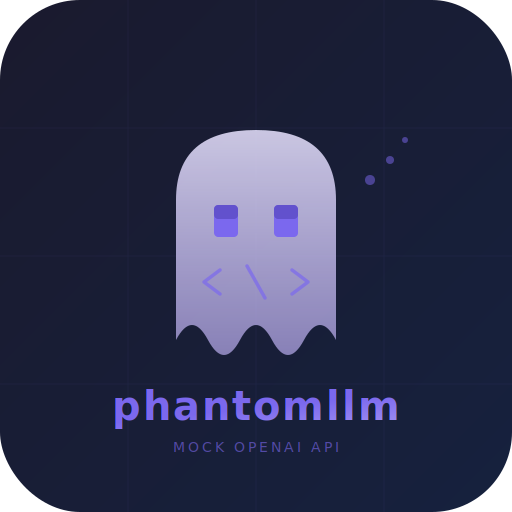

<p align="center">
  
</p>

<h1 align="center">phantomllm</h1>

<p align="center">
  Mock server for OpenAI-compatible APIs.<br/>
  Test your LLM integrations against a real HTTP server instead of patching <code>fetch</code>.
</p>

```typescript
import { MockLLM } from 'phantomllm';

const mock = new MockLLM();
await mock.start();
mock.given.chatCompletion.willReturn('Hello from the mock!');

// mock.apiBaseUrl => "http://localhost:55123/v1" — ready to plug into any client
await mock.stop();
```

## Table of Contents

- [Why phantomllm?](#why-phantomllm)
- [Installation](#installation)
- [Getting the Server URL](#getting-the-server-url)
- [API Reference](#api-reference)
  - [MockLLM](#mockllm)
  - [Chat Completions](#chat-completions)
  - [Streaming](#streaming)
  - [Embeddings](#embeddings)
  - [Error Simulation](#error-simulation)
  - [API Key Validation](#api-key-validation)
  - [Stub Matching](#stub-matching)
- [Integration Examples](#integration-examples)
  - [OpenAI Node.js SDK](#openai-nodejs-sdk)
  - [Vercel AI SDK](#vercel-ai-sdk)
  - [opencode](#opencode)
  - [LangChain](#langchain)
  - [Python openai package](#python-openai-package)
  - [Plain fetch](#plain-fetch)
  - [curl](#curl)
- [Test Framework Integration](#test-framework-integration)
  - [Vitest](#vitest)
  - [Jest](#jest)
  - [Shared Fixture for Multi-File Suites](#shared-fixture-for-multi-file-suites)
- [Performance](#performance)
- [Troubleshooting](#troubleshooting)
- [License](#license)

## Why phantomllm?

- **Real HTTP server** — no monkey-patching `fetch` or `http`. Your SDK makes actual network calls.
- **Zero config** — `npm install phantomllm` and go. No Docker, no external services, no setup steps.
- **Works with any client** — OpenAI SDK, Vercel AI SDK, LangChain, opencode, Python, curl.
- **Streaming support** — SSE chunked responses work exactly like the real OpenAI API.
- **Fast** — in-process Fastify server, sub-millisecond response latency.
- **Simple API** — fluent `given`/`expect` pattern: `mock.given.chatCompletion.forModel('gpt-4').willReturn('Hello')`.

## Installation

```bash
npm install phantomllm --save-dev
```

```bash
pnpm add -D phantomllm
```

```bash
yarn add -D phantomllm
```

That's it. No Docker, no image builds, no extra setup.

## Getting the Server URL

`MockLLM` provides two URL getters:

```typescript
const mock = new MockLLM();
await mock.start();

mock.baseUrl      // "http://127.0.0.1:55123"     — raw host:port
mock.apiBaseUrl   // "http://127.0.0.1:55123/v1"   — includes /v1 prefix
```

**Which one to use:**

| Client / Tool | Property | Example |
|---------------|----------|---------|
| OpenAI SDK (`baseURL`) | `mock.apiBaseUrl` | `new OpenAI({ baseURL: mock.apiBaseUrl })` |
| Vercel AI SDK (`baseURL`) | `mock.apiBaseUrl` | `createOpenAI({ baseURL: mock.apiBaseUrl })` |
| LangChain (`configuration.baseURL`) | `mock.apiBaseUrl` | `new ChatOpenAI({ configuration: { baseURL: mock.apiBaseUrl } })` |
| Plain fetch | `mock.baseUrl` | `` fetch(`${mock.baseUrl}/v1/chat/completions`) `` |

Most SDK clients expect the URL to end with `/v1`. Use `mock.apiBaseUrl` and you won't need to think about it.

## API Reference

### MockLLM

The main class. Starts an in-process HTTP server that implements the OpenAI API.

```typescript
import { MockLLM } from 'phantomllm';

const mock = new MockLLM();
```

| Method / Property | Returns | Description |
|---|---|---|
| `await mock.start()` | `void` | Start the mock server. Idempotent — safe to call twice. |
| `await mock.stop()` | `void` | Stop the server. Idempotent. |
| `mock.baseUrl` | `string` | Server URL without `/v1`, e.g. `http://127.0.0.1:55123`. |
| `mock.apiBaseUrl` | `string` | Server URL with `/v1`, e.g. `http://127.0.0.1:55123/v1`. Pass this to SDK clients. |
| `mock.given` | `GivenStubs` | Entry point for stubbing responses. |
| `mock.expect` | `ExpectConditions` | Entry point for configuring server behavior (API key validation, etc.). |
| `await mock.clear()` | `void` | Remove all stubs and reset server config. Call between tests. |

`MockLLM` implements `Symbol.asyncDispose` for automatic cleanup:

```typescript
{
  await using mock = new MockLLM();
  await mock.start();
  // ... use mock ...
} // mock.stop() called automatically
```

### Chat Completions

Stub `POST /v1/chat/completions` responses.

```typescript
// Any request returns this content
mock.given.chatCompletion.willReturn('Hello!');

// Match by model
mock.given.chatCompletion
  .forModel('gpt-4o')
  .willReturn('I am GPT-4o.');

// Match by message content (case-insensitive substring)
mock.given.chatCompletion
  .withMessageContaining('weather')
  .willReturn('Sunny, 72F.');

// Combine matchers — both must match
mock.given.chatCompletion
  .forModel('gpt-4o')
  .withMessageContaining('translate')
  .willReturn('Bonjour!');
```

| Method | Description |
|---|---|
| `.forModel(model)` | Only match requests with this exact model name. |
| `.withMessageContaining(text)` | Only match when any user message contains this substring (case-insensitive). |
| `.willReturn(content)` | Return a `chat.completion` response with this content. |

### Streaming

Return SSE-streamed responses, matching the real OpenAI streaming format.

```typescript
mock.given.chatCompletion
  .forModel('gpt-4o')
  .willStream(['Hello', ', ', 'world', '!']);
```

Each string becomes a separate `chat.completion.chunk` SSE event with `delta.content`. The stream ends with a chunk containing `finish_reason: "stop"` followed by `data: [DONE]`.

| Method | Description |
|---|---|
| `.willStream(chunks)` | Return a stream of SSE events, one per string in the array. |

### Embeddings

Stub `POST /v1/embeddings` responses.

```typescript
// Single embedding
mock.given.embedding
  .forModel('text-embedding-3-small')
  .willReturn([0.1, 0.2, 0.3]);

// Batch — multiple vectors for multiple inputs
mock.given.embedding
  .willReturn([
    [0.1, 0.2, 0.3],
    [0.4, 0.5, 0.6],
  ]);
```

| Method | Description |
|---|---|
| `.forModel(model)` | Only match requests with this model. |
| `.willReturn(vector)` | Return a single vector (`number[]`) or batch of vectors (`number[][]`). |

### Error Simulation

Force error responses to test retry logic, error handling, and fallbacks.

```typescript
mock.given.chatCompletion.willError(429, 'Rate limit exceeded');
mock.given.chatCompletion.willError(500, 'Internal server error');
mock.given.embedding.willError(400, 'Invalid input');

// Scoped to a specific model
mock.given.chatCompletion
  .forModel('gpt-4o')
  .willError(403, 'Model access denied');
```

Error responses follow the OpenAI error format:

```json
{
  "error": {
    "message": "Rate limit exceeded",
    "type": "api_error",
    "param": null,
    "code": null
  }
}
```

### API Key Validation

Test that your code sends the correct API key.

```typescript
mock.expect.apiKey('sk-test-key-123');

// Requests without a key or with the wrong key get 401
// { error: { message: "...", type: "authentication_error", code: "invalid_api_key" } }

// Only requests with the correct key succeed
const openai = new OpenAI({
  baseURL: mock.apiBaseUrl,
  apiKey: 'sk-test-key-123', // must match exactly
});
```

`mock.expect` configures server constraints at runtime. API key validation applies to all `/v1/*` endpoints. Admin endpoints (`/_admin/*`) are always accessible.

Calling `mock.clear()` resets the API key requirement along with all stubs.

| Method | Description |
|---|---|
| `mock.expect.apiKey(key)` | Require `Authorization: Bearer <key>` on all `/v1/*` requests. |

**Testing auth error handling:**

```typescript
it('handles invalid API key', async () => {
  mock.expect.apiKey('correct-key');
  mock.given.chatCompletion.willReturn('Hello');

  const badClient = new OpenAI({
    baseURL: mock.apiBaseUrl,
    apiKey: 'wrong-key',
  });

  await expect(
    badClient.chat.completions.create({
      model: 'gpt-4o',
      messages: [{ role: 'user', content: 'Hi' }],
    }),
  ).rejects.toThrow();
});
```

### Stub Matching

When multiple stubs are registered, the most specific match wins:

1. **Specificity** — a stub matching both model and content (specificity 2) beats one matching only model (specificity 1), which beats a catch-all (specificity 0).
2. **Registration order** — among stubs with equal specificity, the first registered wins.

```typescript
// Catch-all (specificity 0)
mock.given.chatCompletion.willReturn('Default response');

// Model-specific (specificity 1) — wins over catch-all for gpt-4o
mock.given.chatCompletion
  .forModel('gpt-4o')
  .willReturn('GPT-4o response');

// Model + content (specificity 2) — wins over model-only for matching messages
mock.given.chatCompletion
  .forModel('gpt-4o')
  .withMessageContaining('weather')
  .willReturn('Weather-specific GPT-4o response');
```

When no stub matches a request, the server returns HTTP 418 with a descriptive error message showing what was requested.

## Integration Examples

### OpenAI Node.js SDK

```typescript
import OpenAI from 'openai';
import { MockLLM } from 'phantomllm';

const mock = new MockLLM();
await mock.start();

const openai = new OpenAI({
  baseURL: mock.apiBaseUrl,
  apiKey: 'test-key',
});

// Non-streaming
mock.given.chatCompletion.willReturn('The capital of France is Paris.');

const response = await openai.chat.completions.create({
  model: 'gpt-4o',
  messages: [{ role: 'user', content: 'What is the capital of France?' }],
});
console.log(response.choices[0].message.content);
// => "The capital of France is Paris."

// Streaming
mock.given.chatCompletion.willStream(['The capital', ' of France', ' is Paris.']);

const stream = await openai.chat.completions.create({
  model: 'gpt-4o',
  messages: [{ role: 'user', content: 'Capital of France?' }],
  stream: true,
});

for await (const chunk of stream) {
  process.stdout.write(chunk.choices[0]?.delta?.content ?? '');
}

// Embeddings
mock.given.embedding
  .forModel('text-embedding-3-small')
  .willReturn([0.1, 0.2, 0.3]);

const embedding = await openai.embeddings.create({
  model: 'text-embedding-3-small',
  input: 'Hello world',
});
console.log(embedding.data[0].embedding); // => [0.1, 0.2, 0.3]

await mock.stop();
```

### Vercel AI SDK

```typescript
import { generateText, streamText } from 'ai';
import { createOpenAI } from '@ai-sdk/openai';
import { MockLLM } from 'phantomllm';

const mock = new MockLLM();
await mock.start();

const provider = createOpenAI({
  baseURL: mock.apiBaseUrl,
  apiKey: 'test-key',
});

// generateText
mock.given.chatCompletion.willReturn('Paris');

const { text } = await generateText({
  model: provider.chat('gpt-4o'),
  prompt: 'Capital of France?',
});
console.log(text); // => "Paris"

// streamText
mock.given.chatCompletion.willStream(['Par', 'is']);

const result = streamText({
  model: provider.chat('gpt-4o'),
  prompt: 'Capital of France?',
});

for await (const chunk of result.textStream) {
  process.stdout.write(chunk);
}

await mock.stop();
```

> **Note:** Use `provider.chat('model')` instead of `provider('model')` to ensure requests go through `/v1/chat/completions`.

### opencode

Add a provider entry to your `opencode.json` pointing at the mock:

```jsonc
{
  "provider": {
    "mock": {
      "api": "openai",
      "baseURL": "http://127.0.0.1:PORT/v1",
      "apiKey": "test-key",
      "models": {
        "gpt-4o": { "id": "gpt-4o" }
      }
    }
  }
}
```

Start the mock and print the URL:

```typescript
const mock = new MockLLM();
await mock.start();
console.log(`Set baseURL to: ${mock.apiBaseUrl}`);
```

### LangChain

```typescript
import { ChatOpenAI } from '@langchain/openai';
import { MockLLM } from 'phantomllm';

const mock = new MockLLM();
await mock.start();

mock.given.chatCompletion.willReturn('Hello from LangChain!');

const model = new ChatOpenAI({
  modelName: 'gpt-4o',
  configuration: {
    baseURL: mock.apiBaseUrl,
    apiKey: 'test-key',
  },
});

const response = await model.invoke('Say hello');
console.log(response.content); // => "Hello from LangChain!"

await mock.stop();
```

### Python openai package

The mock server is a real HTTP server — any language can connect to it. Start the mock from Node.js, then use it from Python:

```python
import openai

client = openai.OpenAI(
    base_url="http://127.0.0.1:55123/v1",  # use mock.apiBaseUrl
    api_key="test-key",
)

response = client.chat.completions.create(
    model="gpt-4o",
    messages=[{"role": "user", "content": "Hello"}],
)
print(response.choices[0].message.content)
```

### Plain fetch

```typescript
const response = await fetch(`${mock.baseUrl}/v1/chat/completions`, {
  method: 'POST',
  headers: { 'Content-Type': 'application/json' },
  body: JSON.stringify({
    model: 'gpt-4o',
    messages: [{ role: 'user', content: 'Hello' }],
  }),
});

const data = await response.json();
console.log(data.choices[0].message.content);
```

### curl

```bash
curl http://127.0.0.1:55123/v1/chat/completions \
  -H "Content-Type: application/json" \
  -d '{
    "model": "gpt-4o",
    "messages": [{"role": "user", "content": "Hello"}]
  }'
```

## Test Framework Integration

### Vitest

```typescript
import { describe, it, expect, beforeAll, afterAll, beforeEach } from 'vitest';
import { MockLLM } from 'phantomllm';
import OpenAI from 'openai';

describe('my LLM feature', () => {
  const mock = new MockLLM();
  let openai: OpenAI;

  beforeAll(async () => {
    await mock.start();
    openai = new OpenAI({ baseURL: mock.apiBaseUrl, apiKey: 'test' });
  });

  afterAll(async () => {
    await mock.stop();
  });

  beforeEach(async () => {
    await mock.clear();
  });

  it('should summarize text', async () => {
    mock.given.chatCompletion
      .withMessageContaining('summarize')
      .willReturn('This is a summary.');

    const res = await openai.chat.completions.create({
      model: 'gpt-4o',
      messages: [{ role: 'user', content: 'Please summarize this article.' }],
    });

    expect(res.choices[0].message.content).toBe('This is a summary.');
  });

  it('should handle rate limits', async () => {
    mock.given.chatCompletion.willError(429, 'Rate limit exceeded');

    await expect(
      openai.chat.completions.create({
        model: 'gpt-4o',
        messages: [{ role: 'user', content: 'Hello' }],
      }),
    ).rejects.toThrow();
  });

  it('should stream responses', async () => {
    mock.given.chatCompletion.willStream(['Hello', ' World']);

    const stream = await openai.chat.completions.create({
      model: 'gpt-4o',
      messages: [{ role: 'user', content: 'Hi' }],
      stream: true,
    });

    const chunks: string[] = [];
    for await (const chunk of stream) {
      const content = chunk.choices[0]?.delta?.content;
      if (content) chunks.push(content);
    }
    expect(chunks).toEqual(['Hello', ' World']);
  });
});
```

### Jest

```typescript
import { MockLLM } from 'phantomllm';
import OpenAI from 'openai';

describe('my LLM feature', () => {
  const mock = new MockLLM();
  let openai: OpenAI;

  beforeAll(async () => {
    await mock.start();
    openai = new OpenAI({ baseURL: mock.apiBaseUrl, apiKey: 'test' });
  });

  afterAll(() => mock.stop());
  beforeEach(() => mock.clear());

  test('returns stubbed response', async () => {
    mock.given.chatCompletion.willReturn('Mocked!');

    const res = await openai.chat.completions.create({
      model: 'gpt-4o',
      messages: [{ role: 'user', content: 'Hi' }],
    });

    expect(res.choices[0].message.content).toBe('Mocked!');
  });
});
```

### Shared Fixture for Multi-File Suites

Start one server for your entire test suite:

**`tests/support/mock.ts`**

```typescript
import { MockLLM } from 'phantomllm';

export const mock = new MockLLM();

export async function setup() {
  await mock.start();
  process.env.PHANTOMLLM_URL = mock.apiBaseUrl;
}

export async function teardown() {
  await mock.stop();
}
```

**`vitest.config.ts`**

```typescript
import { defineConfig } from 'vitest/config';

export default defineConfig({
  test: {
    globalSetup: ['./tests/support/mock.ts'],
  },
});
```

**Individual test files**

```typescript
import { mock } from '../support/mock.js';

beforeEach(() => mock.clear());

it('works', async () => {
  mock.given.chatCompletion.willReturn('Hello!');
  // ...
});
```

## Performance

The mock server runs in-process using Fastify — no Docker overhead:

| Metric | Value |
|--------|-------|
| Server startup | < 5ms |
| Chat completion response | ~0.2ms median |
| Streaming (8 chunks) | ~0.2ms total |
| Embedding (1536-dim) | ~0.3ms median |
| Throughput | ~11,000 req/s |

**Tips:**
- Start the server once in `beforeAll`, call `mock.clear()` between tests.
- Use a [shared fixture](#shared-fixture-for-multi-file-suites) for multi-file test suites.

## Troubleshooting

| Problem | Cause | Solution |
|---|---|---|
| `ServerNotStartedError` | Using `baseUrl`, `given`, or `clear()` before `start()`. | Call `await mock.start()` first. |
| Stubs leaking between tests | Stubs persist until cleared. | Call `await mock.clear()` in `beforeEach`. |
| 418 response | No stub matches the request. | Register a stub matching the model/content, or add a catch-all: `mock.given.chatCompletion.willReturn('...')`. |
| AI SDK uses wrong endpoint | `provider('model')` defaults to Responses API in v3+. | Use `provider.chat('model')` to target `/v1/chat/completions`. |

## License

MIT
